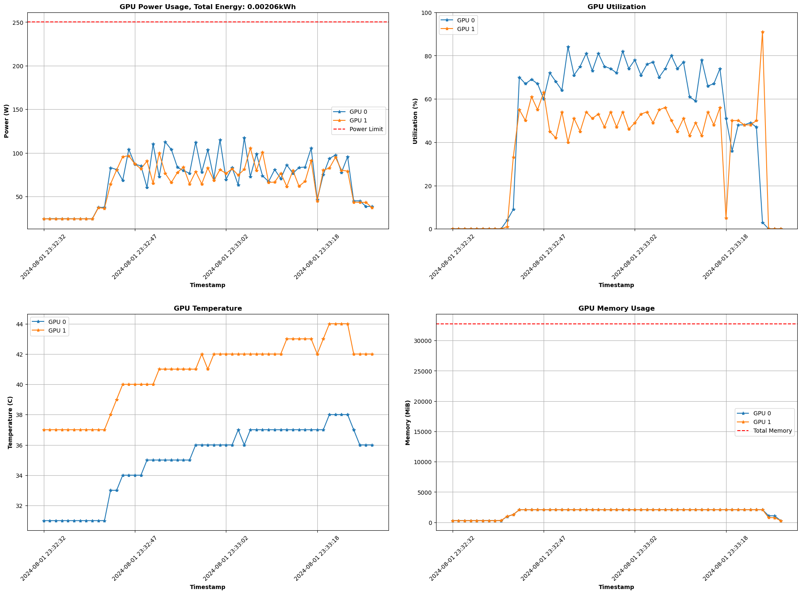

- Add Contents

# GPU Monitoring Tool Usage

## Overview

This tool monitors GPU metrics using the `GPUMonitor` class and optionally exports the collected data to VictoriaMetrics. 

Here's the updated installation section including instructions for building Docker images:

---

## Installation

To set up the project, follow these steps:

1. **Set Up Virtual Environment**:
   Create and activate a virtual environment:
   ```bash
   python3 -m venv env
   source env/bin/activate
   ```

2. **Install the Package**:
   Install the package in editable mode:
   ```bash
   pip install wheel
   pip install .
   ```

## Building Docker Images

If you need to build Docker images for benchmarking, you can use the provided `build_images.sh` script. This script will build images defined in the `Benchmark_Docker` directory. Here’s how to use it:

1. **Navigate to the Docker Directory**:
   Go to the `Benchmark_Docker` directory:
   ```bash
   cd Benchmark_Docker
   ```

2. **Run the Build Script**:
   Execute the build script to build all Docker images:
   ```bash
   ./build_images.sh
   ```

   This script will build Docker images from the Dockerfiles located in `Benchmark_Docker/Benchmark_Dockerfiles`. Feel Free to add your own. The available Dockerfiles and their purposes are:

   - **Base Images**:
     - `Dockerfile.gpu_base`: Base image for GPU-based benchmarks.
     - `Dockerfile.sciml_base`: Base image for SciML benchmarks.
     - `Dockerfile.mantid_base`: Base image for Mantid imaging benchmarks.
   
   - **Mantid Imaging Benchmarks**:
     - `Dockerfile.mantid_run_1`: Dockerfile for Mantid benchmark run 1GB.
     - `Dockerfile.mantid_run_8`: Dockerfile for Mantid benchmark run 8GB.
   
   - **SciML Benchmarks**:
     - `Dockerfile.mnist_tf_keras`: Dockerfile for MNIST classification Benchmark using TensorFlow/Keras.
     - `Dockerfile.stemdl_classification_2gpu`: Dockerfile for STEMDL classification using 1 GPUs
     - `Dockerfile.stemdl_classification_2gpu`: Dockerfile for STEMDL classification using 2 GPUs (There must be 2 available).
     - `Dockerfile.synthetic_regression`: Dockerfile for synthetic regression benchmarks.
    

   - **Empty Benchmark Container**:
     - `Dockerfile.empty_benchmark`: Designed for testing purposes, this Dockerfile sets up a container that runs for 5 minutes before terminating. It is primarily used to profile the GPU resource usage of this monitoring tool. Ideally, the monitor should operate in isolation from the benchmarks to avoid interference. However, currently, the monitor runs in the background on the same VM as the benchmark containers, which poses scalability limitations. To address this in the future, Docker Compose could be used to manage multiple containers simultaneously, but this would require an SSH-based solution to monitor them from an external VM.

This setup will prepare the environment and Docker images required for running your benchmarks effectively.

---

## Command-Line Arguments

The following optional arguments are supported:

- `--no_live_monitor`: Disable live monitoring of GPU metrics. Default is enabled.
- `--interval <seconds>`: Set the interval for collecting GPU metrics. Default is `5` seconds.
- `--carbon_region <region>`: Specify the carbon region for the National Grid ESO Regional Carbon Intensity API. Default is `"South England"`.
- `--no_plot`: Disable plotting of GPU metrics. Default is enabled.
- `--live_plot`: Enable live plotting of GPU metrics.
- `--export_to_victoria`: Enable exporting of collected data to VictoriaMetrics.
- `--benchmark_image <image>`: Docker container image to run as a benchmark (required).
- `--monitor_logs`: Enable monitoring of container logs in addition to GPU metrics.

## Example Commands

1. **Basic Monitoring**:
   ```bash
   iris-gpubench --benchmark_image "synthetic_regression"
   ```

2. **Monitoring with Plotting**:
   ```bash
   iris-gpubench --benchmark_image "synthetic_regression" --plot
   ```

3. **Exporting Data to VictoriaMetrics**:
   ```bash
   iris-gpubench --benchmark_image "synthetic_regression" --export_to_victoria
   ```

4. **Full Command with All Options**:
   ```bash
   iris-gpubench --benchmark_image "synthetic_regression" --no_live_monitor --interval 10 --carbon_region "South England" --no_plot --live_plot --export_to_victoria --monitor_logs
   ```

## Help Option

To display the help message with available options, run:

```bash
iris-gpubench --help
```

---

### Updated Help Option Output

```plaintext
usage: iris-gpubench [-h] [--no_live_monitor] [--interval INTERVAL] [--carbon_region CARBON_REGION] [--no_plot] [--live_plot] [--export_to_victoria] [--benchmark_image BENCHMARK_IMAGE] [--monitor_logs]

Monitor GPU metrics and optionally export data to VictoriaMetrics.

optional arguments:
  -h, --help            show this help message and exit
  --no_live_monitor     Disable live monitoring of GPU metrics (default is enabled).
  --interval INTERVAL   Interval in seconds for collecting GPU metrics (default is 5 seconds).
  --carbon_region CARBON_REGION
                        Region shorthand for The National Grid ESO Regional Carbon Intensity API (default is "South England").
  --no_plot             Disable plotting of GPU metrics (default is enabled).
  --live_plot           Enable live plotting of GPU metrics.
  --export_to_victoria  Enable exporting of collected data to VictoriaMetrics.
  --benchmark_image BENCHMARK_IMAGE
                        Docker container image to run as a benchmark.
  --monitor_logs        Enable monitoring of container logs in addition to GPU metrics.
```

### Notes:
- The `--benchmark_image` argument is required for specifying the Docker container image.
- `--live_monitor` and `--plot` are enabled by default; use `--no_live_monitor` and `--no_plot` to disable them, respectively.

-----------

# Results 

Results are saved to gpu_benchmark_metrics/results (these include):

## 1. Formatted Results

* formatted_metrics.txt : Formatted version of metrics.yml, see example below.

```bash
Benchmark Score and GPU Energy Performance

+---------------------------------------+-----------+
| Metric                                |     Value |
+=======================================+===========+
| Elapsed Monitor Time of Container (s) | 245.627   |
+---------------------------------------+-----------+
| Total GPU Energy Consumed (kWh)       |   0.00993 |
+---------------------------------------+-----------+
| Total GPU Carbon Emissions (gCO2)     |   1.4196  |
+---------------------------------------+-----------+

Carbon Information

+------------------------------------+---------------------+
| Metric                             | Value               |
+====================================+=====================+
| Average Carbon Forecast (gCO2/kWh) | 143.0               |
+------------------------------------+---------------------+
| Carbon Forecast Start Time         | 2024-08-12 17:35:12 |
+------------------------------------+---------------------+
| Carbon Forecast End Time           | 2024-08-12 17:39:18 |
+------------------------------------+---------------------+

GPU Information

+------------------------------------------------+------------------------------------+
| Metric                                         | Value                              |
+================================================+====================================+
| GPU Name                                       | Tesla V100-PCIE-32GB               |
+------------------------------------------------+------------------------------------+
| Average GPU Util. (for >0.00% GPU Util.) (%)   | 92.90476                           |
+------------------------------------------------+------------------------------------+
| Avg GPU Power (for >0.00% GPU Util.) (W)       | 167.42962 (Power Limit: 250)       |
+------------------------------------------------+------------------------------------+
| Avg GPU Temperature (for >0.00% GPU Util.) (C) | 52.33333                           |
+------------------------------------------------+------------------------------------+
| Avg GPU Memory (for >0.00% GPU Util.) (MiB)    | 6500.00595 (Total Memory: 32768.0) |
+------------------------------------------------+------------------------------------+
```
## 2. GPU Metric png Plots (--plot)

* metrics_plot.png: Time series plots for gpu utilization, power usage, temperature and Memory. See example below:
 
  

## 2. GPU Metric Grafana Plots (--export_to_victoria) (NOT WORKING)

INSERT GRAFANA LINK HERE

## 3. Result Metrics

* metrics.yml: yml with the Benchmark Score and GPU Energy Performance results.
  
-----------

# Live Monitoring

## 1. Monitor GPU Metrics (--live_monitor)

```bash
Current GPU Metrics as of 2024-08-01 23:32:47:
+------------------------------------+-------------------+---------------------------+-------------------+------------------------------------+
|   GPU Index (Tesla V100-PCIE-32GB) |   Utilization (%) |   Power (W) / Max 250.0 W |   Temperature (C) |   Memory (MiB) / Total 32768.0 MiB |
+====================================+===================+===========================+===================+====================================+
|                                  0 |                60 |                    87.027 |                34 |                            2075.62 |
+------------------------------------+-------------------+---------------------------+-------------------+------------------------------------+
|                                  1 |                63 |                    87.318 |                40 |                            2075.62 |
+------------------------------------+-------------------+---------------------------+-------------------+------------------------------------+
```

## 2. Save png Timeseries Live (--plot_live)
  
```bash
gpu_monitor --plot_live
```

Gives you saves plot png during every reading so that the metrics can be viewed live.

----------- 

## Please Note:
* The Carbon Data is collected in real-time from the National Grid ESO Regional Carbon Intensity API:
  <https://api.carbonintensity.org.uk/regional>
* The Carbon Forcast and Index Readings are updated every 30 minutes.
* Set your region in gpu_monitor.py: CARBON_INSTENSITY_REGION_SHORTHAND="South England"

* The GPU power metrics and GPU utilization come from "nvidia-smi" results.
* The "error in nvidia-smi's power draw is ± 5%" according to:
  <https://arxiv.org/html/2312.02741v2#:~:text=The%20error%20in%20nvidia%2Dsmi's,%C2%B1%2030W%20of%20over%2Funderestimation.>  


-----------

# Work To Do
- Allow users to save container results
- Fix victoria_metrics exporter (username and password needed) and Test with grafana (add grafana link to docs)
- Improve live monitoring of container ie by threading

- Edit The way "Carbon Forcast (gCO2/kWh)" is computed so that the program checks the Forcast every 30 mins (or less) and computes an average at the end. (Another way to do this would be to multiply the energy consumed each 30 mins (or time interval) by the Forecast for that time and then add them together for a more accurate result. This way we could also give live power updates)
- using shell check from bash script (similar to pylint) on bash script
- Add CI tests for python scripts

