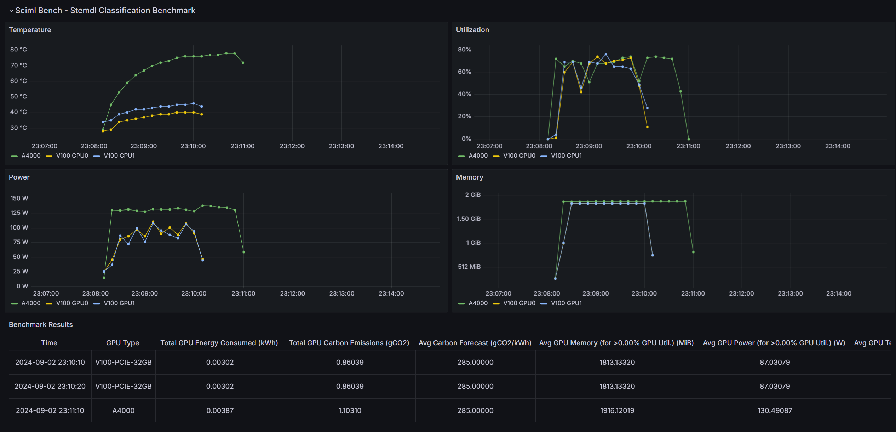

# Collecting Results 

## Summary

By default, results are saved to a `results` folder within the current directory where the `iris-gpubench` command is executed. If the folder does not already exist, it will be created automatically. The folder will contain the following files:

- **Formatted Results Text**: `formatted_metrics.txt`
- **GPU Metrics Timeseries Plot png**: `metrics_plot.png`
- **Results YAML**: `metrics.yml`

If the --export-to-meerkat tag is used, the timeseries data will be sent to a [Grafana Dashboard.](http://172.16.112.145:3000/d/fdw7dv7phr0g0e/iris-bench?orgId=1) This dashboard can be used to visualize and analyze GPU metrics and performance data in a more interactive and detailed way.


## Formatted Results

- **File:** `formatted_metrics.txt`  
- **Description:** A human-readable version of the `metrics.yml` file. Provides a tabular summary of GPU and carbon performance metrics, including benchmark image name, elapsed monitor time, energy consumption, carbon emissions, and detailed GPU performance data.
- **Example:**  
```sh
GPU and Carbon Performance Results

+-----------------------------------+-----------------------+
| Metric                            | Value                 |
+===================================+=======================+
| Benchmark:                        | stemdl_classification |
+-----------------------------------+-----------------------+
| Benchmark Score (s)               | 578.37167             |
+-----------------------------------+-----------------------+
| Elapsed Monitor Time (s)          | 593.71558             |
+-----------------------------------+-----------------------+
| Total GPU Energy Consumed (kWh)   | 0.01593               |
+-----------------------------------+-----------------------+
| Total GPU Carbon Emissions (gCO2) | 1.72052               |
+-----------------------------------+-----------------------+

Carbon Information

+------------------------------------+---------------------+
| Metric                             | Value               |
+====================================+=====================+
| Average Carbon Forecast (gCO2/kWh) | 108.0               |
+------------------------------------+---------------------+
| Carbon Forecast Start Time         | 2024-09-11 14:32:20 |
+------------------------------------+---------------------+
| Carbon Forecast End Time           | 2024-09-11 14:42:14 |
+------------------------------------+---------------------+

GPU Information

+-----------------------------------------------------+------------------------------------+
| Metric                                              | Value                              |
+=====================================================+====================================+
| GPU Type                                            | NVIDIA RTX A4000                   |
+-----------------------------------------------------+------------------------------------+
| No. of GPUs                                         | 1                                  |
+-----------------------------------------------------+------------------------------------+
| Average GPU Utilization (for >0.00% GPU Util.) (%)  | 63.35227                           |
+-----------------------------------------------------+------------------------------------+
| Average GPU Power (for >0.00% GPU Util.) (W)        | 129.36336 (Power Limit: 140)       |
+-----------------------------------------------------+------------------------------------+
| Average GPU Temperature (for >0.00% GPU Util.) (°C) | 73.80682                           |
+-----------------------------------------------------+------------------------------------+
| Temperature Threshold - Slowdown (°C)               | 100.00                             |
+-----------------------------------------------------+------------------------------------+
| Average GPU Memory (for >0.00% GPU Util.) (MiB)     | 1896.26705 (Total Memory: 16376.0) |
+-----------------------------------------------------+------------------------------------+
| Average Clock Speed (MHz)                           | 1779.73 (Max: 2100.00)             |
+-----------------------------------------------------+------------------------------------+
| Average Memory Clock Speed (MHz)                    | 6500.00 (Max: 7001.00)             |
+-----------------------------------------------------+------------------------------------+
```

## GPU Metrics Timeseries Plot png

- **File:** `metrics_plot.png`  
- **Description:** Time series plots showing GPU utilization, power usage, temperature, and memory. This plot aggregates data from multiple GPUs, including maximum power limits, peak memory usage, and total energy consumption calculated from the power usage timeseries.

- **Example:**  


## Result Metrics YAML

- **File:** `metrics.yml`  
- **Description:** Contains formatted data on GPU and carbon performance results. Includes metrics such as benchmark image name, elapsed monitor time, total GPU energy consumed, total carbon emissions, carbon forecast information, and detailed GPU performance data.  


## GPU Metric Grafana Plots 

- **Description:** Exports the collected timeseries gpu metrics for a given benchmark and gpu type to Meerkat DB which is then scraped by a [Grafana Dashboard.](http://172.16.112.145:3000/d/fdw7dv7phr0g0e/iris-bench?orgId=1). The minimum grafana scrape interval is 10s, hence, better precision can be see in `metrics_plot.png` if the `--interval` tag is set to <10s.

- **Example:**  


---

[Previous Page](example_commands.md) | [Next Page](live_monitoring.md)
